# Remote Deployment Workflow

## 🎯 Single Deployment Flow

```mermaid
graph TD
    A[User: 'install remotely'] --> B{Safety Check}
    B -->|Local Project Server| C[❌ STOP - Use MCP Server]
    B -->|MCP Server Request| D[Select MCP Server]
    D --> E[dev-docker, ssh-mcp, suitecrm, api-server]
    E --> F[Connect via 'exec' tool]
    F --> G[Push latest code to git]
    G --> H[Clone/pull on remote server]
    H --> I[Run installation on REMOTE only]
    I --> J[Test on remote server]
    J --> K[Generate documentation]
    K --> L[Update local project docs]
    L --> M[✅ Complete]
    
    C --> N[Use Remote Server Instead]
    N --> D
    
    style B fill:#ff9999
    style C fill:#ffcccc
    style I fill:#ccffcc
    style M fill:#ccffcc
```



## 🚨 Safety Rules

### NEVER on Local Project Server:
- ❌ Software installation
- ❌ Service deployment  
- ❌ System configuration
- ❌ Package compilation
- ❌ Container building (for deployment)

### ALWAYS on Remote MCP Servers:
- ✅ All installation commands
- ✅ Service deployment
- ✅ System modifications
- ✅ Production builds

### Local Project Server ONLY:
- ✅ Git operations
- ✅ Documentation
- ✅ Code editing
- ✅ Testing (cargo test, etc)

## 📋 Command Flow

1. **User Request**: `"install remotely"` or `"remote install [software]"`

2. **Safety Check**: 
   ```bash
   if [[ "$PWD" == *"/Development/"* ]]; then
       echo "Select MCP server: dev-docker, ssh-mcp, suitecrm, api-server"
   fi
   ```

3. **MCP Connection**: Use `exec` tool via `nc localhost [port]`

4. **Remote Operations**: All installation happens on selected MCP server

5. **Documentation**: Update local project with results (no installation)

## 🔧 MCP Server Selection

| Server | Purpose | Use For |
|--------|---------|---------|
| **dev-docker** | Development containers | Docker deployments, testing |
| **ssh-mcp** | SSH MCP testing | This project installation |  
| **suitecrm** | CRM server | SuiteCRM, web applications |
| **api-server** | Production API | Production deployments |

## ⚠️ Error Prevention

**Before any command, ask:**
1. Am I on the local project server?
2. Is this an installation/deployment command?
3. Should this run remotely instead?

**If installation needed locally, STOP and redirect to MCP server.**