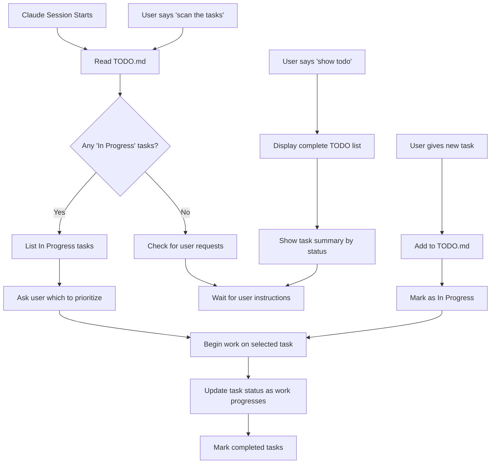

# Task Management System

## Session Startup Procedure (CRITICAL)

**At the start of EVERY conversation, Claude must:**

1. **Read TODO.md** immediately to check for "In Progress" tasks
2. **Identify active work** from the "📋 Current Tasks (In Progress)" section  
3. **Prioritize these tasks** as the next work to be done
4. **Resume work** on these tasks unless user explicitly requests something else
5. **Update task status** as work progresses

## Task Commands

### Task Scanning Command
When user says **"scan the tasks"**, Claude should:
1. **Check for GitHub Project** - Look for project number in TODO.md or ask user
2. **Fetch GitHub Project tasks** - Use `gh project item-list PROJECT_NUMBER`
3. **Analyze and present tasks** - Show tasks organized by status with type/priority
4. **Present options to user** - Display available tasks with type indicators (🐛🚨 Critical Bug)
5. **Wait for user selection** - Let user choose which task to work on
6. **Setup selected task** - Create TodoWrite session and update TODO.md as "In Progress"
7. **Begin work only after user confirmation** - Start work on user-selected task

### Show Todo Command
When user says **"show todo"**, Claude should:
- Read TODO.md completely
- Display the entire TODO list organized by sections
- Show current status of all tasks
- Highlight "In Progress" tasks for immediate attention
- Provide a summary count of tasks by status

## Task Management Workflow

### File Usage Patterns

#### TODO.md (Persistent Tasks)
- **Primary file** for task tracking across sessions
- **Survives** session crashes and context limits
- **Update status** as work progresses: `[ ]` → `[x]`
- **Move tasks** between sections: Current → Next → Ideas → Completed
- **Add completion dates** for completed tasks
- **Mark active work as "In Progress"** so Claude can resume in future sessions

#### TodoWrite Tool (Temporary Tasks)
- **Session-based** todos for immediate work tracking
- **Good for** tracking work within a single conversation
- **Does not persist** between sessions
- **Use for** temporary, tactical task management

### Task Flow Diagram

## Best Practices

### Task States
- **Current Tasks (In Progress)** - Active work, highest priority
- **Next Tasks (Planned)** - Queued work, ready to start
- **Ideas & Future Tasks** - Backlog, nice-to-have features
- **Completed Tasks** - Finished work with completion dates

### Session Management
- **Always start** by reading TODO.md
- **Prioritize "In Progress" tasks** over new requests
- **Update task status** in real-time as work progresses
- **Mark completion dates** when tasks are finished
- **Ask for clarification** if multiple "In Progress" tasks exist

### Task Descriptions
- **Be specific** - "Fix authentication bug" not "Fix bug"
- **Include context** - Reference files, functions, or systems involved
- **Add estimates** - Time or complexity indicators when helpful
- **Link related tasks** - Reference dependencies or related work

## Emergency Procedures

### Session Crashes
- **TODO.md persists** - No work is lost
- **Resume immediately** from "In Progress" tasks
- **Check TodoWrite** - May have lost temporary session tasks

### Context Limits
- **TODO.md survives** context window limits
- **Key information** is preserved in persistent file
- **Restart workflow** begins with TODO.md scan

### Conflicting Instructions
- **TODO.md takes precedence** over TodoWrite for important tasks
- **User explicit requests** override automatic task resumption
- **"In Progress" tasks** have priority over "Planned" tasks