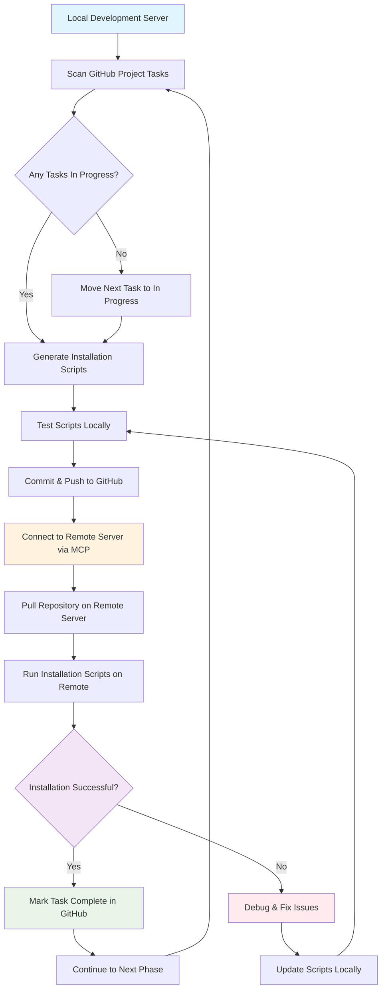

# SSH MCP Multi-Server Development & Deployment Flow

## Process Overview



## Detailed Flow Steps

### 1. Local Development Phase
```
┌─────────────────────────────────────────┐
│ Local Development Server                │
│ /mnt/sdc/alistair/Development/          │
│ ssh-mcp-multi-server/                   │
├─────────────────────────────────────────┤
│ • Scan GitHub project for In Progress   │
│ • Generate installation scripts         │
│ • Test script syntax and logic          │
│ • Commit changes to git                 │
│ • Push to GitHub repository             │
└─────────────────────────────────────────┘
```

### 2. Remote Server Deployment Phase  
```
┌─────────────────────────────────────────┐
│ Remote Server (Bare/Clean Install)     │
│ Connected via MCP SSH                   │
├─────────────────────────────────────────┤
│ • Clone/pull repository                 │
│ • Execute installation scripts          │
│ • Validate installation success         │
│ • Report results back                   │
└─────────────────────────────────────────┘
```

### 3. Feedback & Iteration Loop
```
Installation Success? ──┐
                       │
    ┌─────────────────────┴─────────────────────┐
    │                                           │
    ▼ YES                                       ▼ NO
┌─────────────────┐                    ┌─────────────────┐
│ Mark Complete   │                    │ Debug & Fix     │
│ Move Next Task  │                    │ Update Scripts  │
│ Continue Cycle  │                    │ Test & Retry    │
└─────────────────┘                    └─────────────────┘
                                              │
                                              │
                                              ▼
                                       ┌─────────────────┐
                                       │ Return to       │
                                       │ Local Dev Phase │
                                       └─────────────────┘
```

## Implementation Commands

### Local Development Server Commands
```bash
# 1. Scan for in-progress tasks and generate scripts
# (This is automated via GitHub project scanning)

# 2. Test scripts locally (syntax check)
bash -n installation/scripts/*.sh

# 3. Commit and push changes
git add -A
git commit -m "Phase X.X: Description of changes"
git push origin main
```

### Remote Server Commands (via MCP SSH)
```bash
# 1. Initial setup (bare server)
sudo apt update && sudo apt install -y git

# 2. Clone repository  
git clone https://github.com/alistairhendersoninfo/ssh-mcp-multi-server.git
cd ssh-mcp-multi-server

# 3. Make scripts executable
chmod +x installation/scripts/*.sh

# 4. Run installation scripts in sequence
sudo ./installation/scripts/01-system-hardening.sh
sudo ./installation/scripts/02-container-firewall-setup.sh
# Continue with additional phases...

# 5. Validate installation
sudo ./installation/validation/security-tests.sh
```

## Error Handling Strategy

### When Installation Fails:
1. **Capture Error Details**
   ```bash
   # Check logs on remote server
   tail -100 /var/log/ssh-mcp-install/*.log
   
   # Check system status
   systemctl status containerd
   getenforce  # SELinux status
   ```

2. **Return to Local Development**
   - Analyze error logs
   - Fix scripts locally
   - Test fixes
   - Commit and push updates

3. **Retry on Remote Server**
   ```bash
   # Pull latest changes
   git pull origin main
   
   # Re-run failed script
   sudo ./installation/scripts/XX-failed-script.sh
   ```

## Phase Implementation Sequence

```
Phase 1.1 ──► Phase 1.2 ──► Phase 2.1 ──► Phase 2.2 ──► Phase 2.3
   │             │             │             │             │
   ▼             ▼             ▼             ▼             ▼
System        Container    Nomad Setup   Vault Setup   PostgreSQL
Hardening     Runtime                                   & Traefik
   │             │             │             │             │
   ▼             ▼             ▼             ▼             ▼
Phase 3.1 ──► Phase 4.1 ──► Phase 5.1 ──► Phase 6.1 ──► Phase 7.1
   │             │             │             │             │
   ▼             ▼             ▼             ▼             ▼
Container     User Mgmt    Backup       Install      Documentation
Images        & TOTP       System       Script       & Operations
```

## Success Criteria for Each Phase

- ✅ Scripts execute without errors
- ✅ Validation tests pass
- ✅ Services start and run properly  
- ✅ Security configurations applied
- ✅ Logs show successful completion
- ✅ Next phase dependencies met

## Communication Flow

```
Local Dev ←→ GitHub Repository ←→ Remote Server
    ↑                                      ↓
    │                                      │
    └──────── MCP SSH Connection ──────────┘
```

This iterative development and deployment process ensures:
- **Rapid iteration** on installation scripts
- **Real-world testing** on clean server environments  
- **Version control** of all changes
- **Automated validation** of each phase
- **Rollback capability** when issues occur
- **Documentation** of the entire process