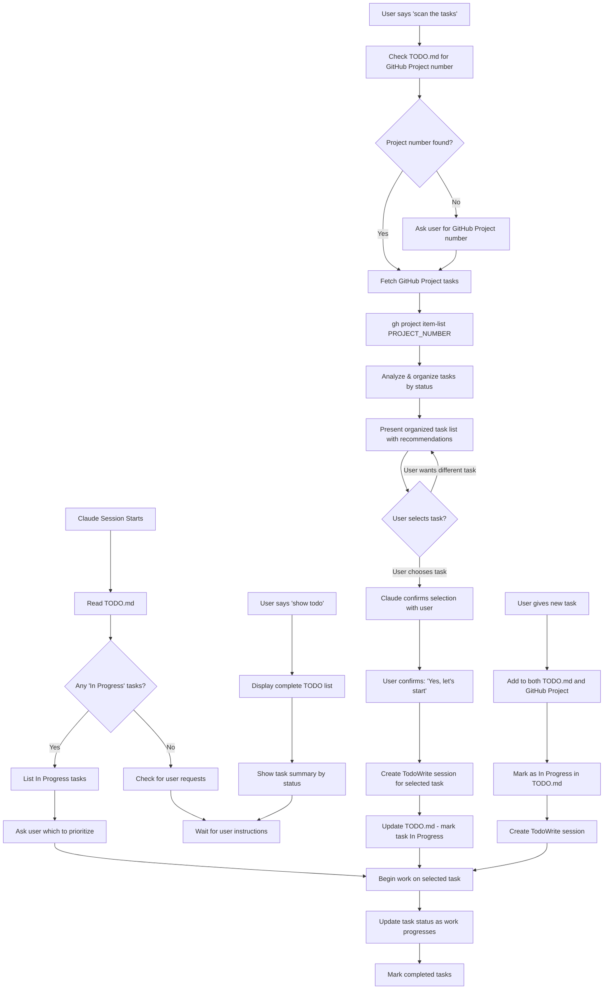

# Task Management System

## Session Startup Procedure (CRITICAL)

**At the start of EVERY conversation, Claude must:**

1. **Read TODO.md** immediately to check for "In Progress" tasks
2. **Identify active work** from the "📋 Current Tasks (In Progress)" section  
3. **Prioritize these tasks** as the next work to be done
4. **Resume work** on these tasks unless user explicitly requests something else
5. **Update task status** as work progresses

## Task Commands

### Task Scanning Command
When user says **"scan the tasks"**, Claude should:
1. **Check for GitHub Project** - Look for project number in TODO.md or ask user
2. **Fetch GitHub Project tasks** - Use `gh project item-list PROJECT_NUMBER`
3. **Analyze and present tasks** - Show tasks organized by status and priority
4. **Present options to user** - Display available tasks with context and recommendations
5. **Wait for user selection** - Let user choose which task to work on
6. **Setup selected task** - Create TodoWrite session and update TODO.md as "In Progress"
7. **Begin work only after user confirmation** - Start work on user-selected task

### Show Todo Command
When user says **"show todo"**, Claude should:
- Read TODO.md completely
- Display the entire TODO list organized by sections
- Show current status of all tasks
- Highlight "In Progress" tasks for immediate attention
- Provide a summary count of tasks by status

## Task Management Workflow

### File Usage Patterns

#### TODO.md (Persistent Tasks)
- **Primary file** for task tracking across sessions
- **Survives** session crashes and context limits
- **Update status** as work progresses: `[ ]` → `[x]`
- **Move tasks** between sections: Current → Next → Ideas → Completed
- **Add completion dates** for completed tasks
- **Mark active work as "In Progress"** so Claude can resume in future sessions

#### TodoWrite Tool (Temporary Tasks)
- **Session-based** todos for immediate work tracking
- **Good for** tracking work within a single conversation
- **Does not persist** between sessions
- **Use for** temporary, tactical task management

### Task Flow Diagram



## Integration with GitHub Projects

### GitHub Projects Task Scanning Workflow

When user says **"scan the tasks"**, the complete workflow is:

#### 1. Project Discovery
```bash
# Check TODO.md for existing GitHub Project information
grep "Project Number" TODO.md
# If not found, ask user for project number or URL
```

#### 2. Fetch GitHub Tasks
```bash
# Get all project items with status
gh project item-list PROJECT_NUMBER --format json

# Alternative: Get specific status items
gh project item-list PROJECT_NUMBER --format json | jq '.items[] | select(.status.name == "In Progress" or .status.name == "Draft")'
```

#### 3. Task Analysis & Presentation
Claude should analyze and present tasks to the user:
- **Organize by Status**: Group by "In Progress", "Draft", "To Do", etc.
- **Show Type and Priority**: Display 🐛 bug, ✨ feature, 🚨 Critical, etc.
- **Highlight Urgent Items**: Flag critical priority and blocker tasks
- **Show Dependencies**: Note tasks that are blocking or blocked by others
- **Display Context**: Include assignees, recent activity, and descriptions
- **Filter by Type**: Option to show only bugs, only features, etc.
- **Provide Recommendations**: Suggest logical next tasks based on type/priority
- **Present Options Clearly**: Number tasks with type/priority indicators

**Example Task Presentation:**
```
📋 GitHub Project Tasks Available:

🚨 CRITICAL PRIORITY:
1. 🐛 [bug] Fix authentication timeout in production
2. 🐛 [bug] Database connection leak causing crashes

🔴 HIGH PRIORITY:  
3. ✨ [feature] Add user dashboard with analytics
4. 🚀 [enhancement] Improve login page performance

🟡 MEDIUM PRIORITY:
5. 📚 [documentation] Update API documentation
6. 🧪 [test] Add integration tests for payment flow

🟢 LOW PRIORITY:
7. 🔧 [refactor] Clean up utility functions  
8. 🏠 [chore] Update dependencies

Which task would you like to work on? (Enter number or type to filter: 'bugs', 'features', etc.)
```

#### 4. User Selection & Session Setup
**User Control Flow:**
1. **User reviews presented tasks** - Claude shows organized task list
2. **User selects task** - "I want to work on task #3" or similar
3. **Claude confirms selection** - Repeats task details and asks for confirmation  
4. **User confirms** - "Yes, let's start" or provides additional context
5. **Claude sets up work session**:
   ```bash
   # For bug/feature/enhancement tasks - Development workflow
   if [[ "$TASK_TYPE" =~ ^(bug|feature|enhancement)$ ]]; then
     if [[ "$TASK_STATUS" == "In Progress" ]]; then
       # Resume existing work - find existing issue/branch/folder
       echo "🔄 Resuming work on existing issue..."
       # Check for existing issue, branch, and work folder
       # Switch to existing branch and work folder
     else
       # Execute complete development setup (see .claude/DEVELOPMENT-WORKFLOW.md)
       - Create GitHub issue
       - Create feature branch  
       - Set up work/issue-${ISSUE_NUMBER}/ folder
       - Create draft PR
       - Initialize development environment
     fi
   fi
   
   # Create TodoWrite session with selected task
   TodoWrite([
     {id: 1, content: "GitHub Task: [user-selected task title]", status: "in_progress"},
     {id: 2, content: "Set up issue #${ISSUE_NUMBER} and branch", status: "pending"},
     {id: 3, content: "Implement solution", status: "pending"},
     {id: 4, content: "Add tests", status: "pending"},
     {id: 5, content: "Create/update PR", status: "pending"}
   ])
   ```

#### 5. Local TODO.md Sync
- Update TODO.md to mark selected task as "In Progress"
- Add GitHub Project reference if missing
- Ensure local and remote tasks stay synchronized

### Project Creation Workflow
When user says **"create project and task"**, Claude will:
1. **Extract project name** from context or ask user
2. **Create GitHub Project** named `{project-name}-development`
3. **Add task type classification fields** to the project:
   - **Type**: bug, feature, enhancement, documentation, refactor, test, chore
   - **Priority**: critical, high, medium, low
   - **Labels**: Custom tags for organization
4. **Sync initial tasks** from TODO.md or add default development tasks with types
5. **Update TODO.md** with GitHub Project information and links
6. **Report** the project URL and next steps

#### Task Creation with Classification
When adding tasks to GitHub Projects, Claude should:
1. **Identify task type** from context or ask user:
   - 🐛 **bug** - Something isn't working
   - ✨ **feature** - New functionality  
   - 🚀 **enhancement** - Improve existing feature
   - 📚 **documentation** - Documentation updates
   - 🔧 **refactor** - Code restructuring
   - 🧪 **test** - Testing related
   - 🏠 **chore** - Maintenance tasks
2. **Set priority level** based on impact and urgency
3. **Add relevant labels** for organization

#### GitHub CLI Commands for Task Classification

**Create Project with Custom Fields:**
```bash
# Create project
gh project create --title "project-name-development"

# Add Type field (single select)
gh api graphql -f query='
mutation {
  addProjectV2Field(input: {
    projectId: "PROJECT_ID"
    dataType: SINGLE_SELECT
    name: "Type"
    singleSelectOptions: [
      {name: "🐛 bug", color: RED}
      {name: "✨ feature", color: BLUE}  
      {name: "🚀 enhancement", color: GREEN}
      {name: "📚 documentation", color: YELLOW}
      {name: "🔧 refactor", color: PURPLE}
      {name: "🧪 test", color: ORANGE}
      {name: "🏠 chore", color: GRAY}
    ]
  }) {
    projectV2Field { id }
  }
}'

# Add Priority field (single select)  
gh api graphql -f query='
mutation {
  addProjectV2Field(input: {
    projectId: "PROJECT_ID"
    dataType: SINGLE_SELECT
    name: "Priority"
    singleSelectOptions: [
      {name: "🚨 Critical", color: RED}
      {name: "🔴 High", color: ORANGE}
      {name: "🟡 Medium", color: YELLOW}
      {name: "🟢 Low", color: GREEN}
    ]
  }) {
    projectV2Field { id }
  }
}'
```

**Add Task with Type and Priority:**
```bash
# Add task with classification
gh project item-add PROJECT_NUMBER \
  --title "Fix authentication bug in login flow" \
  --body "Users cannot log in after password reset. Error occurs in auth middleware."

# Update item fields (requires field IDs from project setup)
gh project item-edit --project PROJECT_NUMBER --id ITEM_ID \
  --field-id TYPE_FIELD_ID --single-select-option-id BUG_OPTION_ID

gh project item-edit --project PROJECT_NUMBER --id ITEM_ID \
  --field-id PRIORITY_FIELD_ID --single-select-option-id HIGH_OPTION_ID
```

## Development Workflow Integration

**⚠️ CRITICAL: See `.claude/DEVELOPMENT-WORKFLOW.md` for complete development lifecycle.**

### Git Command Intelligence

When user issues git-related commands, Claude should:

#### "git push" Command
- **Detect current branch** vs main branch
- **Warn if pushing to main** - Ask for confirmation
- **Auto-update PR** if on feature branch
- **Ask about PR readiness** - Mark as ready for review?

#### "make production" or "merge code" Commands
- **Complete merge workflow** - Tests, merge, cleanup
- **Update GitHub Project** status to "Done"
- **Clean up work folders** after successful merge
- **Switch back to main** branch and pull latest

#### Development Task Setup (bug/feature/enhancement)
- **Create GitHub issue** automatically
- **Create feature branch** with naming convention
- **Set up work/issue-${ISSUE_NUMBER}/ folder**
- **Create draft PR** linked to issue
- **Initialize development checklist**

### Sync Commands
```bash
# Manual sync between TODO.md and GitHub Projects
.claude/scripts/sync_todo_with_github.sh PROJECT_NUMBER

# Sync specific direction
.claude/scripts/sync_todo_with_github.sh PROJECT_NUMBER to-github
.claude/scripts/sync_todo_with_github.sh PROJECT_NUMBER from-github
```

### Task Integration Flow
1. **TODO.md** serves as persistent task tracking (survives sessions)
2. **GitHub Projects** provides team collaboration via web interface  
3. **Manual sync script** available for complex synchronization needs
4. **Claude handles** project creation and task management directly

## Best Practices

### Task States
- **Current Tasks (In Progress)** - Active work, highest priority
- **Next Tasks (Planned)** - Queued work, ready to start
- **Ideas & Future Tasks** - Backlog, nice-to-have features
- **Completed Tasks** - Finished work with completion dates

### Session Management
- **Always start** by reading TODO.md
- **Prioritize "In Progress" tasks** over new requests
- **Update task status** in real-time as work progresses
- **Mark completion dates** when tasks are finished
- **Ask for clarification** if multiple "In Progress" tasks exist

### Task Descriptions
- **Be specific** - "Fix authentication bug" not "Fix bug"
- **Include context** - Reference files, functions, or systems involved
- **Add estimates** - Time or complexity indicators when helpful
- **Link related tasks** - Reference dependencies or related work

## Emergency Procedures

### Session Crashes
- **TODO.md persists** - No work is lost
- **Resume immediately** from "In Progress" tasks
- **Check TodoWrite** - May have lost temporary session tasks

### Context Limits
- **TODO.md survives** context window limits
- **Key information** is preserved in persistent file
- **Restart workflow** begins with TODO.md scan

### Conflicting Instructions
- **TODO.md takes precedence** over TodoWrite for important tasks
- **User explicit requests** override automatic task resumption
- **"In Progress" tasks** have priority over "Planned" tasks