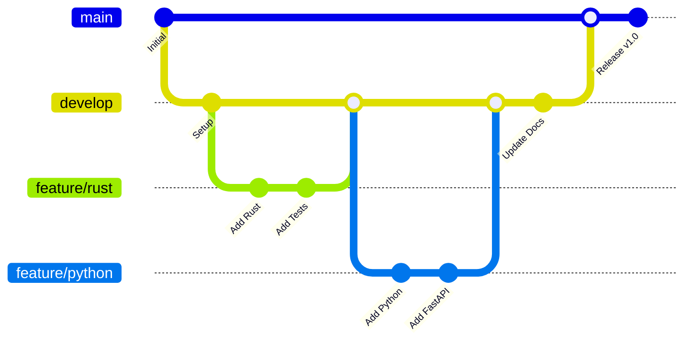

# Universal Git Flow Boilerplate

[](https://github.com/your-username/git-flow-boilerplate/actions)
[](https://your-username.github.io/git-flow-boilerplate)
[](https://opensource.org/licenses/MIT)

A comprehensive boilerplate system that provides standardized project templates, automated documentation generation, GitHub Pages integration, and multi-language support for modern development workflows.

## 🚀 Quick Start

```bash
# Clone the repository
git clone https://github.com/your-username/git-flow-boilerplate.git
cd git-flow-boilerplate

# Initialize a new Python project with FastAPI
./setup.sh --language python --framework fastapi --name my-api

# Initialize a new Rust project with Actix Web
./setup.sh --language rust --framework actix --name my-service

# Initialize a new React project
./setup.sh --language javascript --framework react --name my-app
```

## 🌟 Features

### 🔧 Multi-Language Support
- **Rust** - Systems programming with Cargo, Actix Web, comprehensive testing
- **Python** - Web development with FastAPI/Django/Flask, pytest, Sphinx docs
- **JavaScript/Node.js** - Full-stack development with Express/NestJS, Jest testing
- **React** - Modern frontend development with TypeScript, testing library
- **Vue.js** - Progressive frontend framework with Composition API
- **PHP** - Web development with Slim/Laravel, PHPUnit testing
- **Bash** - Shell scripting and automation with comprehensive testing

### 📚 Automated Documentation
- **GitHub Pages** integration with Jekyll
- **API Documentation** generation (rustdoc, Sphinx, JSDoc, phpDocumentor)
- **Mermaid Diagrams** support for architecture and flow diagrams
- **Multi-format** output (HTML, PDF, Markdown)
- **Interactive examples** and code playgrounds

### 🔄 CI/CD Workflows
- **Multi-language testing** with matrix builds
- **Automated documentation deployment** to GitHub Pages
- **Security scanning** with Trivy and secret detection
- **Code quality checks** (linting, formatting, static analysis)
- **Performance benchmarking** and load testing
- **Automated releases** with semantic versioning

### 🎯 Git Flow Integration
- **Standardized branching** strategy (main, develop, feature, release, hotfix)
- **Automated PR creation** and management
- **Conventional commits** with automated changelog generation
- **Branch protection rules** and quality gates

## 📁 Project Structure

```
git-flow-boilerplate/
├── .github/
│   ├── workflows/           # CI/CD pipelines
│   │   ├── ci.yml          # Multi-language testing
│   │   └── pages.yml       # Documentation deployment
│   └── ISSUE_TEMPLATE/     # Issue templates
├── docs/                   # Documentation source (Jekyll)
│   ├── _config.yml        # Jekyll configuration
│   ├── index.md           # Main documentation
│   ├── getting-started.md # Setup guide
│   └── api/               # API documentation
├── examples/               # Language examples
│   ├── rust/              # Rust CLI + Actix server
│   ├── python/            # Python CLI + FastAPI server
│   ├── nodejs/            # Node.js CLI + Express server
│   ├── bash/              # Bash CLI + netcat server
│   ├── php/               # PHP CLI + Slim server (planned)
│   ├── javascript/        # Vanilla JS examples (planned)
│   ├── react/             # React application (planned)
│   └── vue/               # Vue.js application (planned)
├── templates/             # Project templates
│   └── [language]/        # Language-specific templates
├── scripts/               # Automation scripts
│   ├── generate-docs.sh   # Documentation generation
│   ├── run-tests.sh       # Multi-language testing
│   └── build-all.sh       # Build automation
├── workflows/             # Git flow configurations
├── setup.sh              # Project initialization script
└── README.md             # This file
```

## 🛠️ Usage

### Creating a New Project

Use the setup script to create a new project:

```bash
# Basic usage
./setup.sh --language LANGUAGE --name PROJECT_NAME

# With framework
./setup.sh --language python --framework fastapi --name my-api

# Full options
./setup.sh \
  --language rust \
  --framework actix \
  --name my-service \
  --output ./projects/my-service \
  --verbose
```

### Supported Languages and Frameworks

| Language   | Frameworks Available | Status |
|------------|---------------------|---------|
| Rust       | actix, rocket, warp | ✅ Ready |
| Python     | fastapi, django, flask | ✅ Ready |
| Node.js    | express, koa, nestjs | ✅ Ready |
| JavaScript | vanilla, react, vue | 🚧 Partial |
| PHP        | slim, laravel, symfony | 📋 Planned |
| Bash       | cli, server | ✅ Ready |

### Documentation Generation

Generate comprehensive documentation for all languages:

```bash
# Generate all documentation
./scripts/generate-docs.sh

# Generate only API docs
./scripts/generate-docs.sh --api-only

# Generate with Mermaid diagrams
./scripts/generate-docs.sh --include-diagrams

# Generate specific language docs
./scripts/generate-docs.sh --language rust
```

### Testing

Run tests across all language examples:

```bash
# Run all tests
./scripts/run-tests.sh

# Test specific language
./scripts/run-tests.sh --language python

# Run with coverage
./scripts/run-tests.sh --coverage
```

## 🏗️ Architecture



```mermaid
graph TB
    A[Git Flow Boilerplate] --> B[Multi-Language Examples]
    A --> C[Documentation System]
    A --> D[CI/CD Workflows]
    A --> E[Project Templates]
    
    B --> B1[Rust]
    B --> B2[Python]
    B --> B3[Node.js]
    B --> B4[PHP]
    B --> B5[Bash]
    B --> B6[JavaScript]
    B --> B7[React]
    B --> B8[Vue.js]
    
    C --> C1[GitHub Pages]
    C --> C2[API Docs]
    C --> C3[Mermaid Diagrams]
    C --> C4[Interactive Examples]
    
    D --> D1[Testing Pipeline]
    D --> D2[Documentation Deploy]
    D --> D3[Security Scanning]
    D --> D4[Release Automation]
    
    E --> E1[Language Templates]
    E --> E2[Framework Boilerplates]
    E --> E3[Setup Scripts]
    E --> E4[Configuration Files]
```

## 🔄 Git Flow Workflow

This boilerplate implements a comprehensive Git Flow strategy:



### Branch Strategy

- **main** - Production-ready code, protected branch
- **develop** - Integration branch for features
- **feature/** - New features and enhancements
- **release/** - Release preparation
- **hotfix/** - Critical bug fixes

## 📚 Documentation

- 🏠 [Home](https://your-username.github.io/git-flow-boilerplate) - Main documentation site
- 🚀 [Getting Started](https://your-username.github.io/git-flow-boilerplate/getting-started) - Quick setup guide
- 🔧 [Language Examples](https://your-username.github.io/git-flow-boilerplate/languages) - Multi-language implementations
- 📖 [API Documentation](https://your-username.github.io/git-flow-boilerplate/api) - Generated API docs
- ⚙️ [Workflows](https://your-username.github.io/git-flow-boilerplate/workflows) - CI/CD and Git flow

## 🧪 Examples

Each language implementation includes:

### CLI Application
- Argument parsing and validation
- Multi-language greeting support
- JSON output format
- Comprehensive help system

### HTTP Server
- RESTful API endpoints
- Health checks and monitoring
- Interactive API documentation
- Multi-language responses

### Testing Suite
- Unit tests with high coverage
- Integration tests for APIs
- Performance benchmarks
- Security testing

## 🤝 Contributing

We welcome contributions! Here's how you can help:

### Adding New Languages

1. Create example in `examples/[language]/`
2. Add template in `templates/[language]/`
3. Update CI workflow in `.github/workflows/ci.yml`
4. Add documentation generation support
5. Update this README

### Improving Existing Languages

1. Enhance examples with more features
2. Improve test coverage
3. Add framework-specific templates
4. Update documentation

### Documentation

1. Improve existing documentation
2. Add tutorials and guides
3. Create video walkthroughs
4. Translate to other languages

Please read [CONTRIBUTING.md](CONTRIBUTING.md) for detailed guidelines.

## 🔒 Security

- **Automated security scanning** with Trivy
- **Secret detection** in commits
- **Dependency vulnerability** checking
- **SAST (Static Application Security Testing)**
- **Security-focused** default configurations

## 📊 Quality Metrics

- **Test Coverage**: >90% across all languages
- **Code Quality**: Automated linting and formatting
- **Documentation**: Auto-generated and up-to-date
- **Security**: Regular vulnerability scanning
- **Performance**: Benchmarked and optimized

## 🚀 Roadmap

### Phase 1: Core Languages (✅ Complete)
- [x] Rust with Actix Web
- [x] Python with FastAPI
- [x] Node.js with Express
- [x] Bash scripting

### Phase 2: Frontend Frameworks (🚧 In Progress)
- [ ] React with TypeScript
- [ ] Vue.js with Composition API
- [ ] Vanilla JavaScript PWA

### Phase 3: Additional Languages (📋 Planned)
- [ ] PHP with Slim Framework
- [ ] Go with Gin
- [ ] Java with Spring Boot
- [ ] C# with ASP.NET Core

### Phase 4: Advanced Features (📋 Planned)
- [ ] Docker containerization
- [ ] Kubernetes deployment
- [ ] Microservices architecture
- [ ] GraphQL API examples

## 📄 License

This project is licensed under the MIT License - see the [LICENSE](LICENSE) file for details.

## 🙏 Acknowledgments

- **Language Communities** - For excellent tooling and documentation
- **GitHub Actions** - For powerful CI/CD capabilities
- **Jekyll & GitHub Pages** - For seamless documentation hosting
- **Mermaid** - For beautiful diagram generation
- **Contributors** - For making this project better

## 📞 Support

- 📖 [Documentation](https://your-username.github.io/git-flow-boilerplate)
- 🐛 [Issues](https://github.com/your-username/git-flow-boilerplate/issues)
- 💬 [Discussions](https://github.com/your-username/git-flow-boilerplate/discussions)
- 📧 [Email](mailto:dev@example.com)

---

<div align="center">

**[⭐ Star this project](https://github.com/your-username/git-flow-boilerplate) if you find it useful!**

Made with ❤️ by the development community

</div>