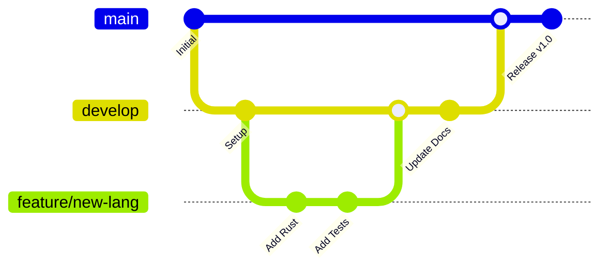

# Welcome to Universal Git Flow Boilerplate

A comprehensive boilerplate system that provides standardized project templates, automated documentation generation, GitHub Pages integration, and multi-language support for modern development workflows.

## 🚀 Quick Start

```bash
# Clone the repository
git clone https://github.com/alistairhendersoninfo/git-flow-boilerplate.git
cd git-flow-boilerplate

# Initialize a new project
./setup.sh --language python --framework django

# Generate documentation
./scripts/generate-docs.sh

# Run tests
./scripts/run-tests.sh
```

## 🌟 Features

### Multi-Language Support
- **Rust** - Systems programming with Cargo
- **Python** - Web development with Django/Flask
- **JavaScript/Node.js** - Full-stack development
- **React** - Modern frontend development
- **Vue.js** - Progressive frontend framework
- **PHP** - Web development with Composer
- **Bash** - Shell scripting and automation

### Automated Documentation
- **GitHub Pages** integration
- **API Documentation** generation
- **Mermaid Diagrams** support
- **Multi-format** output (HTML, PDF, Markdown)

### CI/CD Workflows
- **Automated Testing** across all languages
- **Documentation Deployment** 
- **Multi-environment** support
- **Security Scanning**

## 📚 Documentation

<div class="grid">
  <div class="card">
    <h3><a href="/getting-started">Getting Started</a></h3>
    <p>Quick setup guide and basic usage</p>
  </div>
  
  <div class="card">
    <h3><a href="/languages">Languages</a></h3>
    <p>Supported programming languages and frameworks</p>
  </div>
  
  <div class="card">
    <h3><a href="/workflows">Workflows</a></h3>
    <p>Git flow and CI/CD pipeline documentation</p>
  </div>
  
  <div class="card">
    <h3><a href="/examples">Examples</a></h3>
    <p>Hello world examples and boilerplate code</p>
  </div>
</div>

## 🔄 Git Flow Diagram



## 🤝 Contributing

We welcome contributions! Please see our [Contributing Guide](CONTRIBUTING.md) for details.

## 📄 License

This project is licensed under the MIT License - see the [LICENSE](LICENSE) file for details.