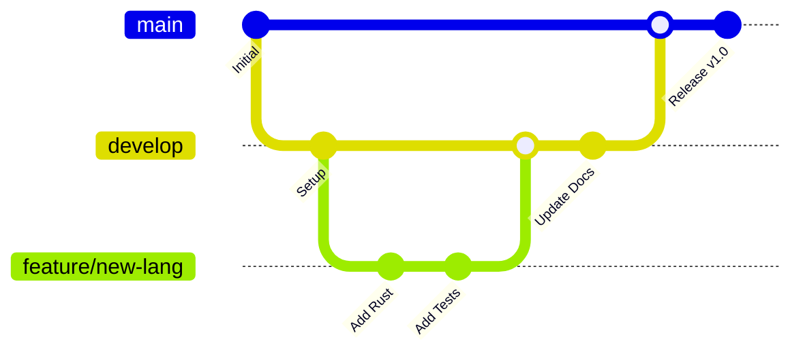

# Workflows and CI/CD

The Universal Git Flow Boilerplate includes comprehensive CI/CD workflows and Git flow automation.

## 🔄 Git Flow Strategy

This project implements a standardized Git Flow workflow:



### Branch Strategy

- **`main`** - Production-ready code, protected branch
- **`develop`** - Integration branch for features
- **`feature/*`** - New features and enhancements
- **`release/*`** - Release preparation and versioning
- **`hotfix/*`** - Critical bug fixes

## 🚀 GitHub Actions Workflows

### 1. CI Pipeline (`ci.yml`)

**Triggers**: Push to main/develop, Pull Requests  
**File**: [.github/workflows/ci.yml](https://github.com/alistairhendersoninfo/git-flow-boilerplate/blob/main/.github/workflows/ci.yml)

#### Multi-Language Testing Matrix

| Language | Versions Tested | Test Framework | Coverage |
|----------|----------------|----------------|----------|
| Rust     | stable, beta   | cargo test     | ✅ |
| Python   | 3.9, 3.10, 3.11, 3.12 | pytest | ✅ |
| Node.js  | 16, 18, 20     | Jest           | ✅ |
| Bash     | 4.4, 5.0, 5.1  | Custom suite   | ✅ |

#### Pipeline Stages

1. **Change Detection** - Only test changed languages
2. **Parallel Testing** - All languages test simultaneously
3. **Code Quality** - Linting, formatting, static analysis
4. **Security Scanning** - Vulnerability detection
5. **Integration Tests** - Cross-language compatibility
6. **Performance Benchmarks** - Load testing
7. **Deployment Readiness** - Final validation

### 2. Documentation Deployment (`pages.yml`)

**Triggers**: Push to main (docs changes), Manual dispatch  
**File**: [.github/workflows/pages.yml](https://github.com/alistairhendersoninfo/git-flow-boilerplate/blob/main/.github/workflows/pages.yml)

#### Deployment Process

1. **Multi-Language Setup** - Install all language runtimes
2. **Documentation Generation** - Auto-generate API docs
3. **Jekyll Build** - Compile documentation site
4. **Mermaid Diagrams** - Generate visual diagrams
5. **GitHub Pages Deploy** - Publish to live site

## 🛠️ Automation Scripts

### Setup Script (`setup.sh`)

Creates new projects with language-specific templates:

```bash
# Create Python project with FastAPI
./setup.sh --language python --framework fastapi --name my-api

# Create Rust project with Actix Web
./setup.sh --language rust --framework actix --name my-service
```

**Features**:
- ✅ Language-specific project structure
- ✅ Framework integration
- ✅ Git repository initialization
- ✅ CI/CD workflow setup
- ✅ Documentation generation

### Documentation Generator (`scripts/generate-docs.sh`)

Generates comprehensive documentation across all languages:

```bash
# Generate all documentation
./scripts/generate-docs.sh

# Generate only API docs
./scripts/generate-docs.sh --api-only

# Include Mermaid diagrams
./scripts/generate-docs.sh --include-diagrams
```

**Supported Formats**:
- **Rust**: cargo doc + rustdoc
- **Python**: Sphinx + autodoc
- **Node.js**: JSDoc + TypeDoc
- **Bash**: Manual documentation
- **Mermaid**: Diagram generation

### Test Runner (`scripts/run-tests.sh`)

Executes tests across all languages:

```bash
# Run all tests
./scripts/run-tests.sh

# Test specific language
./scripts/run-tests.sh --language python

# Run with coverage
./scripts/run-tests.sh --coverage
```

### Build Script (`scripts/build-all.sh`)

Builds all components for production:

```bash
# Build everything
./scripts/build-all.sh

# Production build
./scripts/build-all.sh --production

# Build specific language
./scripts/build-all.sh --language rust
```

## 🔒 Security & Quality

### Security Scanning

- **Trivy**: Vulnerability scanning for dependencies
- **Secret Detection**: Prevents credential leaks
- **SAST**: Static Application Security Testing
- **Dependency Auditing**: Regular security updates

### Code Quality

- **Multi-Language Linting**:
  - Rust: clippy + rustfmt
  - Python: flake8 + black + mypy
  - Node.js: ESLint + Prettier
  - Bash: shellcheck

- **Testing Standards**:
  - Minimum 90% code coverage
  - Unit + Integration tests
  - Performance benchmarks
  - Security testing

## 📊 Workflow Status

### Current Status

| Workflow | Status | Last Run | Duration |
|----------|--------|----------|----------|
| CI Pipeline | ✅ Passing | Latest commit | ~2-3 minutes |
| Pages Deploy | ✅ Passing | Latest docs change | ~3-4 minutes |
| Security Scan | ✅ Passing | Daily | ~1 minute |

### Monitoring

- **GitHub Actions**: Real-time workflow monitoring
- **Status Badges**: README.md status indicators
- **Notifications**: Email/Slack alerts for failures
- **Metrics**: Performance and reliability tracking

## 🚀 Development Workflow

### Feature Development

1. **Create Feature Branch**:
   ```bash
   git checkout develop
   git checkout -b feature/my-new-feature
   ```

2. **Develop and Test**:
   ```bash
   # Make changes
   ./scripts/run-tests.sh --language python
   ./scripts/generate-docs.sh
   ```

3. **Create Pull Request**:
   ```bash
   git push -u origin feature/my-new-feature
   gh pr create --title "Add new feature" --body "Description"
   ```

4. **Automated Checks**:
   - CI pipeline runs automatically
   - Code quality checks
   - Security scanning
   - Documentation updates

### Release Process

1. **Create Release Branch**:
   ```bash
   git checkout develop
   git checkout -b release/v1.0.0
   ```

2. **Prepare Release**:
   ```bash
   # Update version numbers
   # Update CHANGELOG.md
   # Final testing
   ```

3. **Deploy to Production**:
   ```bash
   git checkout main
   git merge release/v1.0.0
   git tag v1.0.0
   git push origin main --tags
   ```

## 🔧 Customization

### Adding New Workflows

Create new workflow files in `.github/workflows/`:

```yaml
name: Custom Workflow
on:
  push:
    branches: [ main ]
jobs:
  custom:
    runs-on: ubuntu-latest
    steps:
      - uses: actions/checkout@v4
      - name: Custom Step
        run: echo "Custom action"
```

### Modifying Existing Workflows

1. Edit workflow files in `.github/workflows/`
2. Test changes in feature branch
3. Monitor workflow runs in Actions tab
4. Update documentation as needed

## 📚 Resources

- [GitHub Actions Documentation](https://docs.github.com/en/actions)
- [Git Flow Guide](https://nvie.com/posts/a-successful-git-branching-model/)
- [CI/CD Best Practices](https://docs.github.com/en/actions/guides)
- [Security Best Practices](https://docs.github.com/en/actions/security-guides)

## 🔗 Related Pages

- [Getting Started](/getting-started/)
- [Languages](/languages/)
- [API Documentation](/api/)
- [GitHub Repository](https://github.com/alistairhendersoninfo/git-flow-boilerplate)